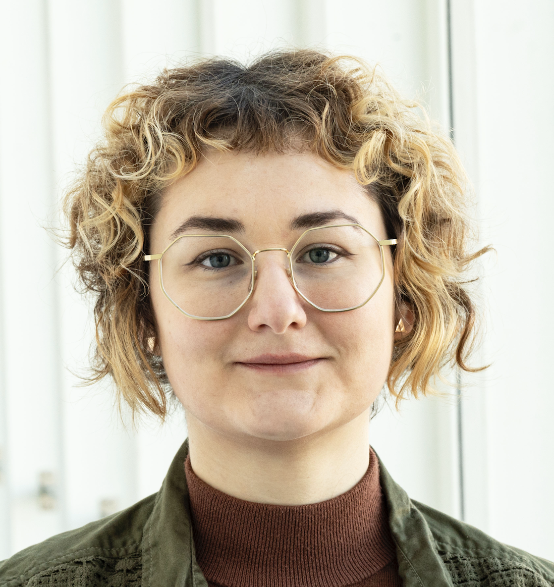

:::: {.hero}

::: {.hero-photo}

{.profile}

### Mariia Seleznova

Junior Research Group Leader

::: {.profile-links}
<i class="bi bi-geo-alt"></i> TU Darmstadt, Germany

<i class="bi bi-envelope"></i>
[Email](mailto:m.seleznova@stsl.tu-darmstadt.de)

<i class="bi bi-mortarboard"></i>
[Google Scholar](https://scholar.google.com/citations?user=4-2hQt8AAAAJ&hl=uk)
:::

:::

::: {.hero-text}
# Hi!

I'm a Junior Research Group Leader in the Signal Theory and Statistical Learning group at [TU Darmstadt](https://www.tu-darmstadt.de/), funded through the [DFG Emmy Noether Programme](https://www.dfg.de/en/research-funding/funding-opportunities/programmes/individual/emmy-noether). I am also a Guest Scientist in the Data Science Group at the [Max Planck Institute of Quantum Optics](https://www.mpq.mpg.de/en). 

My research focuses on the mathematical foundations of deep learning. I use probability and random matrix theory to understand how large neural networks generalize, when they remain stable, and why existing mathematical models often fail to capture their behavior.

Before joining TU Darmstadt, I was a postdoctoral researcher at the [Chair for Mathematical Foundations of Artificial Intelligence](https://www.math.lmu.de/math4ai/en/) at Ludwig Maximilian University of Munich, where I also completed my PhD under the supervision of [Gitta Kutyniok](https://www.math.lmu.de/math4ai/en/members/contact-page/gitta-kutyniok-0eedf402.html). 

::: {.join-box}
**Open positions: PhD & HiWi**

I'm looking for PhD students and student research assistants (HiWis) to join my group at TU Darmstadt. If you're interested, please send me an email with your CV, transcript(s), and a few words about your mathematical and machine learning background.
:::

:::

::::

